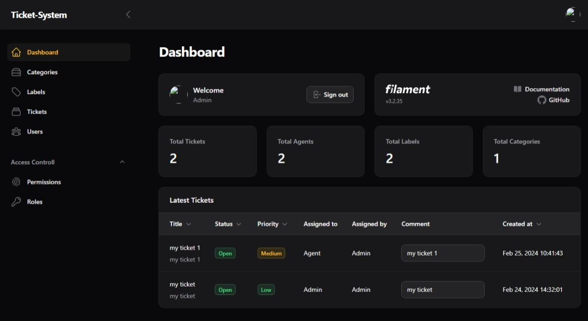
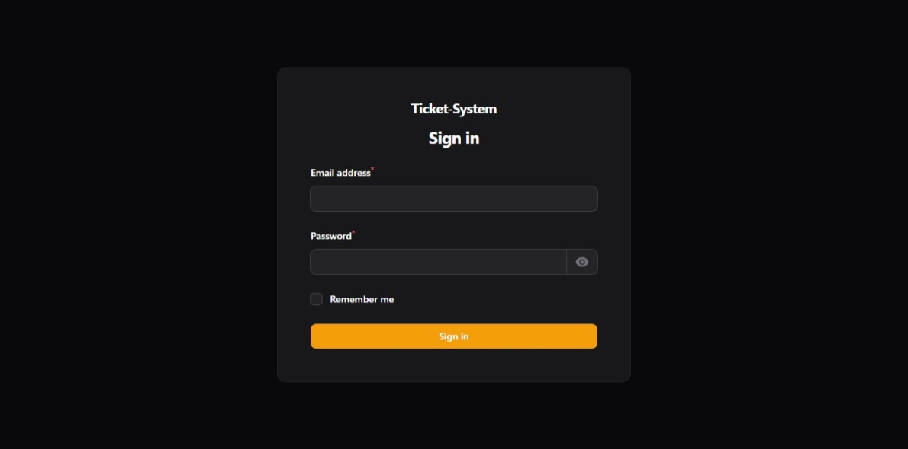
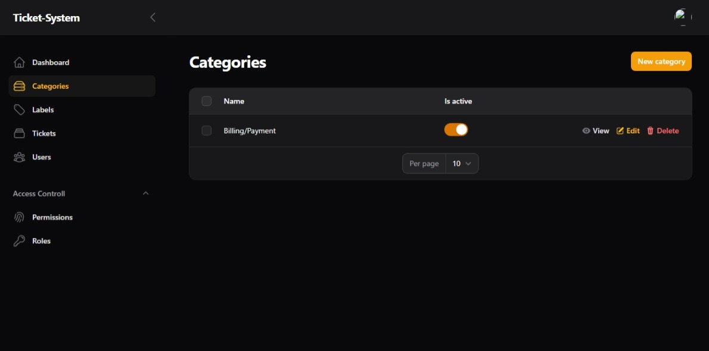
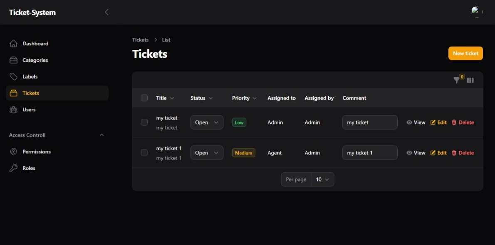
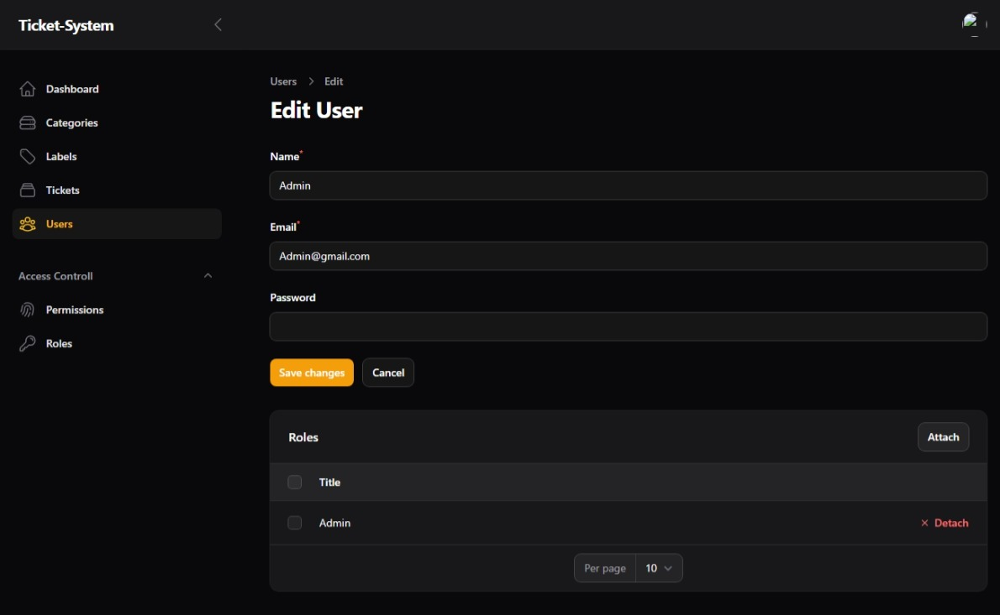
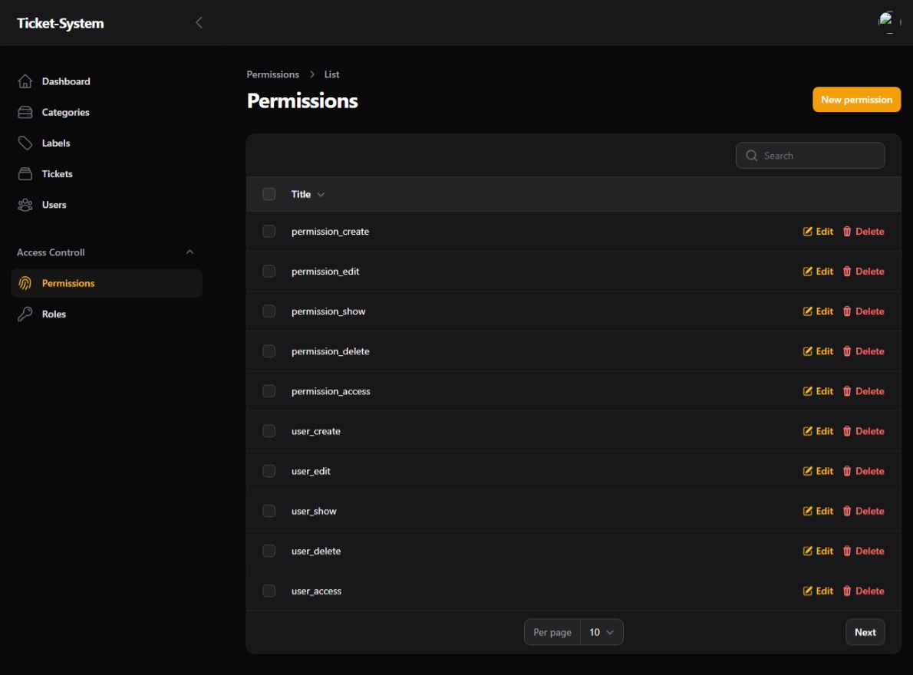
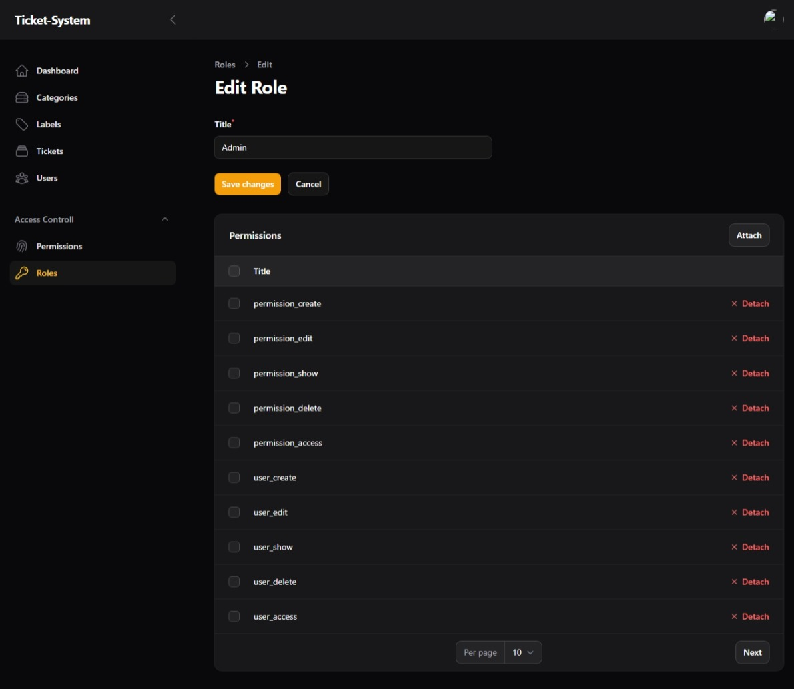
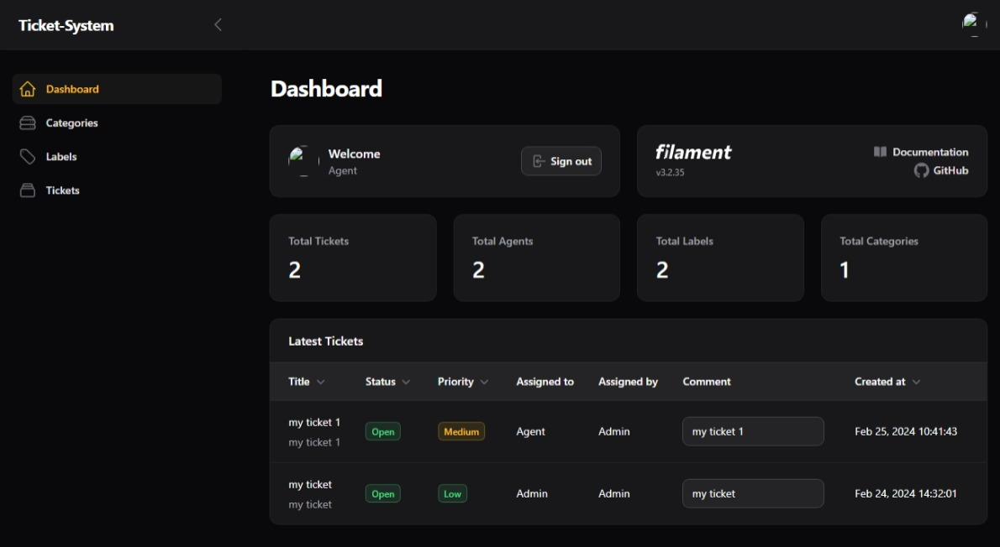
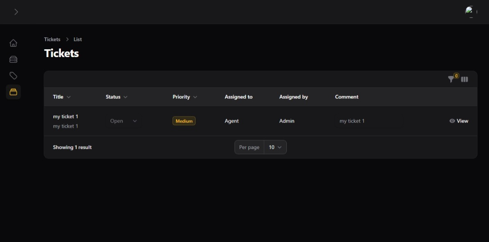

<h3>building a support ticket system</h3>

I used Laravel 10 && Filament V3
  

The Admin Dashboard Page
  
 

Login page
  
 

Admin Categories page
  
 

Admin Tickets page
  
 

Admin Edit User page
  
 

Permissions page
  
 

Role Edit page
  
 

Agent Dashboard page
  
 

Agent Tickets page
  
 
